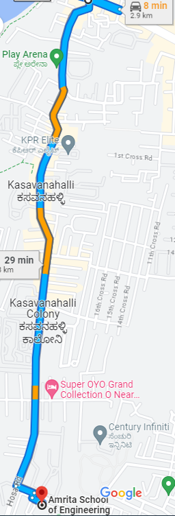
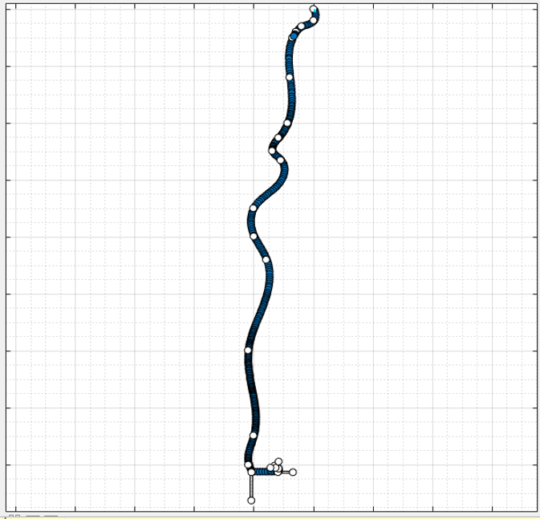
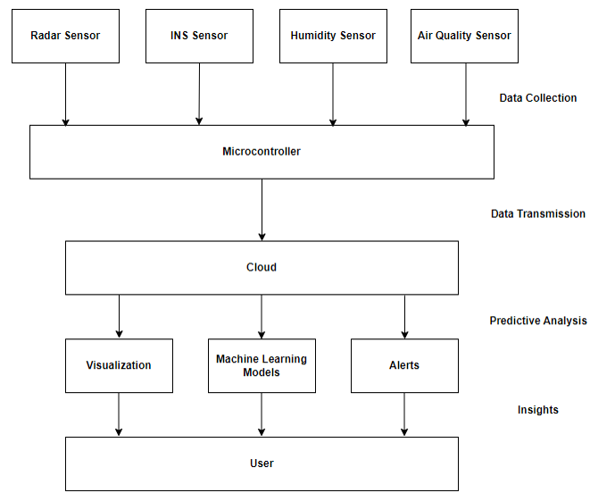

# A Framework for Fleet Management using IoT and Predictive Analytics

An IoT-based framework for real-time fleet visualization and predictive analytics, inspired by Bengaluru’s traffic challenges. The system uses MATLAB and ThingSpeak for data collection, simulation, and analysis. The architecture can be extended with additional sensors and machine learning models. 

The full research paper can be accessed here:
[Research Paper](https://ieeexplore.ieee.org/abstract/document/10724253)

# Tools Used
1. MATLAB

    i) Automated Driving ToolBox

    ii) Driving Scenario Designer

2. ThingSpeak

# Custom Track
The Bengaluru Track Heavy Traffic Area was selected. The Google Map image of the track is shown below:

The Bengaluru track was created using the Driving Scenario Designer which is shown below:

# Sensors Used
1. RADAR Sensor
2. Inertial Navigation System (INS) Sensor
3. Humidity Sensor
4. Air Quality Sensor

# Flow Chart

